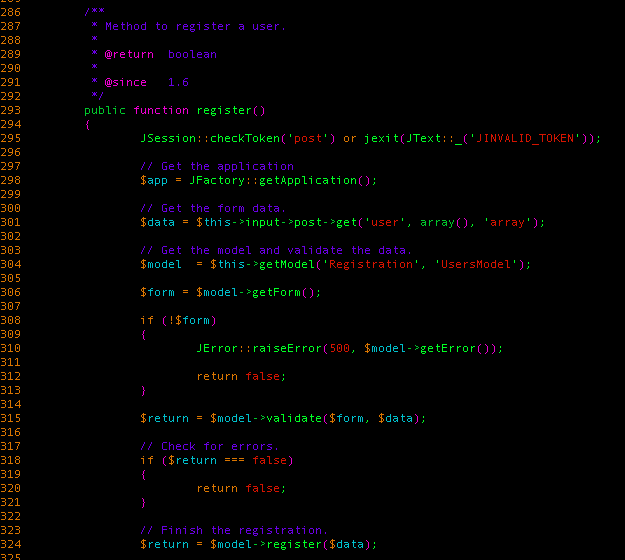
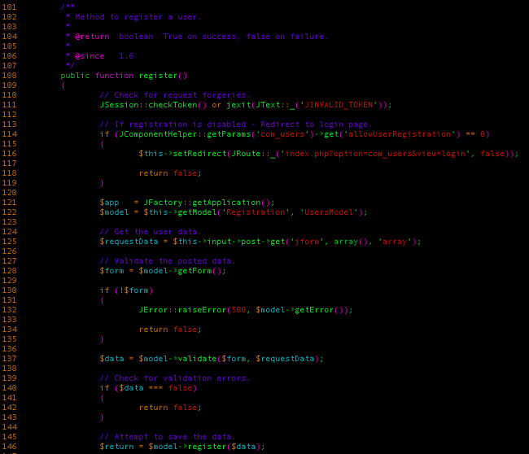
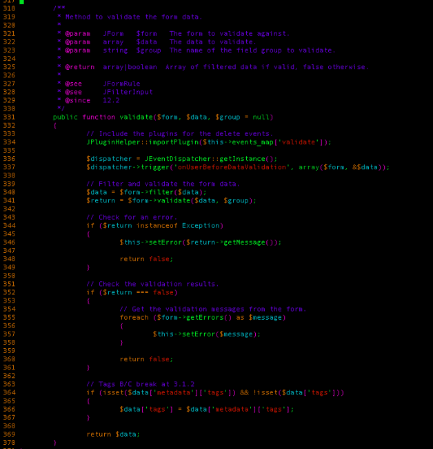
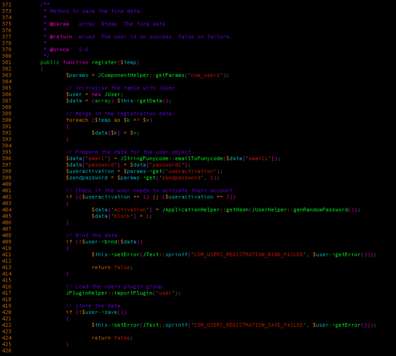

# Joomla Account Creation and Privilege Escalation
## CVE:2016-8869 / 2016-8870

CVE Reference :  [CVE-2016-8869](https://cve.mitre.org/cgi-bin/cvename.cgi?name=CVE-2016-8869), [CVE-2016-8870](https://cve.mitre.org/cgi-bin/cvename.cgi?name=CVE-2016-8870)


### POC

For the demonstration i have setted joomla website on localhost using xampp server.
software setup :
- xampp 5.6.20
- joomla 3.4.4 < 3.6.4
- php 5.6 (joomla 3.4.4 runs on php 5.6)


This is the administrator panel of the website. There is only one entry for the movement which is admin.


Open the terminal and go to the exploit file location. Then run the exploit file.
```
./joomraa.py -u test -p password -e ad@gmail.com http://kali/Joomla/
```


After run the exploit, I got some issues and export did not complete properly.


I am running this joomla website on local host. Some parameters are set correctly on local host. but in real scenario this may work properly.So I have to set it on a separate server.

#### From Arbitrary Account Creation to Remote Code Execution
Using all of these factors combined, we managed to craft an internal exploit to test our WAF that not only allows us to create an account even when account registration is disabled, but also changes the administrator’s username, password, and email address!
As administrators can install extension packages on their site, an attacker could use his freshly hacked administrator account to upload a remote shell on the site and further compromise the server.


### Analyzing the Patch
It was fairly easy to figure out where the vulnerable code was, as pretty much all the patch does (with the exception of fixing an additional two factor authentication bug) is basically remove the register method from the UsersControllerUser class. So that’s where our investigation started.



All in all, what this method does is it takes user input from the user POST parameter (which is intended to be an associative array) and validates whether specific parameters are properly formatted (email address, username, etc.). If it’s all good, it pushes the array to the register method from the UsersModelRegistration class.

#### Step #1 – Creating an Account

At this point, one question popped in our mind: “Why would they remove that method? Won’t that break sites that allows users to register an account?”

We quickly discovered that Joomla uses another controller class for registering users, UsersControllerRegistration, which also has a register method:



While the two look very similar, they present two very important differences:

- The script first checks if user registrations are enabled, something the other register method didn’t do. As the two methods are publicly accessible, it allows users to create accounts even if the option supposed to restrict this possibility is disabled.
- This method uses what returns from UsersModelRegistration‘s validate method to register the user. The former register method barely used this to validate if the data was successfully processed.
This very subtle difference is what caused the privilege escalation vulnerability to be possible.

#### Step #2 – Getting Higher Privileges

At this point, you might ask yourself why this seemingly innocent difference is causing such mayhem. The answer is pretty simple to understand when we take a look at what the validate method does internally.



Essentially, it passes the user input $data into the $form filter method, which has pretty much the same effect as PHP’s array_intersect_key function: it only keeps the parameters located in $data if they are also in the $form variable. This way, they can limit what’s being sent to their model classes. After processing the array, it checks if all of the values are properly formatted and then returns the modified $data array.
See where we are going with this? If you read step #1 carefully, you’ll remember that the vulnerable register method didn’t use validate‘s return to register the user.
What this means is that any additional parameters we send will go through the model’s user registration code unsanitized.



When looking at $model’s register method (located in the UsersModelRegistration class), we see that the data we send gets submitted to JUser‘s bind method – before saving the $user instance to the database.
The bind method basically takes every $key => $value pairs from our $data array and sets the corresponding $user instance property $key with its $value. This means that an attacker can override any properties present in the JUser class- which will be saved in the database not long after that as a new user.
So what property would we want to override? Good candidates would be any these (or a combination of them):

- the $groups property, which contains an array with the numeric ID of the groups the user belongs to (such groups are managers, authors, and administrators)
- the $id property, which contains the ID of the user we want to save (remember, we’re dealing with the JUser class here – which doesn’t know if we’re registering or updating a user)

#### Solution:   
The vendor has issued a fix (3.6.4).


