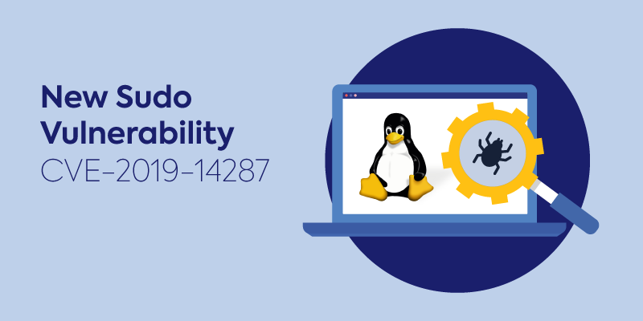
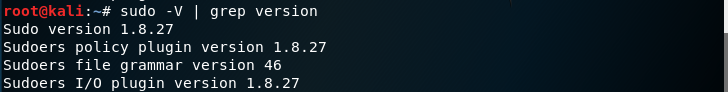
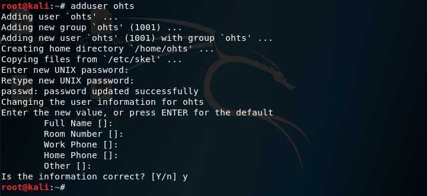
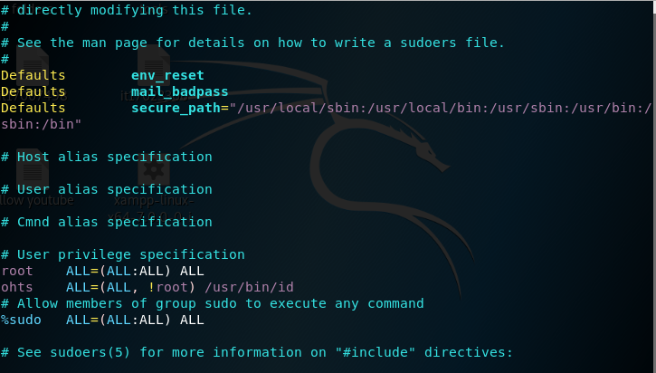
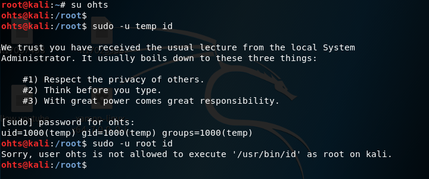
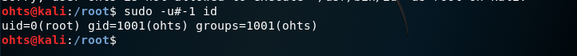

# Sudo Vulnerability (CVE-2019-14287)
### this is demostration on CVE-2019-14287 vulnerability

Here is everything you need to know about the Sudo vulnerability, how it works, and how to handle the vulnerable Sudo component, if you find that you are currently at risk.



Let’s start with the basics.Sudo (superuser do) is a utility for UNIX- and Linux-based systems that provides an efficient way to give specific users permission to use specific system commands at the root (most powerful) level of the system. Sudo also logs all commands and arguments. Using sudo, a system administrator can: 

- Give some users (or groups of users) the ability to run some (or all) commands at the root level of system operation
- Control which commands a user can use on each host
- See clearly from a log which users used which commands
- Using timestamp files, control the amount of time a user has to enter commands after they have entered their password and been granted appropriate privileges

On October 14, the Sudo team published a security alert about CVE-2019-14287, a new security issue discovered by Joe Vennix of Apple Information Security, in all Sudo versions prior to version 1.8.28. The security flaw could enable a malicious user to execute arbitrary commands as root user even in cases where the root access is disallowed.

### How user information is stored in Linux

Each user account has a username, unique identifier (UID), group(GID), home directory, and the default shell to be used when the user logs in to the system.
All user account related information is stored in the passwd file, located in /etc/passwd
Passwords in the passwd file are encrypted and are therefore represented by an x.
The encrypted passwords for accounts are stored in the shadow file, located in /etc/shadow. The shadow file can only be accessed by the root user.

### Structure of user account

username:password:UID:GID:comments:home_directory:shell
The first user in the passwd file is the root account
The root account always has a UID of 0
System accounts have a UID of less than 1000 while user accounts have UID >= 1000

### The sudoers file

The sudoers file contains all the permissions for users and groups on a Linux system. it is found in /etc/sudoers
The sudoers file can be accessed and modified securely by using visudo.
visudo is a tool that allows you to access and make changes to the sudoers file securely, it does this by ensuring that only one user is editing the sudoers file and by checking for logical errors.

We will use visudo to demonstrate the exploit.

### exploitaion

The issue occurs when a sysadmin inserts an entry into the sudoers file, for example:
```
jacob myhost = (ALL, !root) /usr/bin/chmod
```
This entry means that user jacob is allowed to run “chmod” as any user except the root user, meaning a security policy is in place in order to limit access.
Unfortunately, Joe Vennix from Apple Information Security found that the function fails to parse all values correctly and when giving the parameter user id “-1” or its unsigned number “4294967295”, the command will run as root, bypassing the security policy entry we set in the example above. 

### POC

sudo version



Create a user 'ohts'



Modify the sudoers file
```
visudo
ohts  ALL=(ALL, !root) /usr/bin/id
```


Change the user to 'ohts'
then run 'id' command as 'temp' user
but when we run 'id' command as 'root', permision denied.



But when we run the command with '-1' or '4294967295' it will run as root




